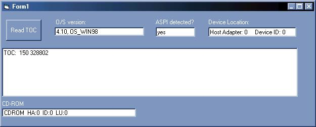

<div align="center">

## Using ASPI\(wnaspi32\.dll\) in VB


</div>

### Description

This tutorial will help you using ASPI in your VB-Project.
 
### More Info
 


<span>             |<span>
---                |---
**Submitted On**   |2002-04-02 21:22:44
**By**             |[actorics\.de](https://github.com/Planet-Source-Code/PSCIndex/blob/master/ByAuthor/actorics-de.md)
**Level**          |Advanced
**User Rating**    |5.0 (15 globes from 3 users)
**Compatibility**  |VB 6\.0
**Category**       |[OLE/ COM/ DCOM/ Active\-X](https://github.com/Planet-Source-Code/PSCIndex/blob/master/ByCategory/ole-com-dcom-active-x__1-29.md)
**World**          |[Visual Basic](https://github.com/Planet-Source-Code/PSCIndex/blob/master/ByWorld/visual-basic.md)
**Archive File**   |[Using\_ASPI127730962002\.zip](https://github.com/Planet-Source-Code/actorics-de-using-aspi-wnaspi32-dll-in-vb__1-38727/archive/master.zip)


### Source Code

```
To use this article, check if you got wnaspi32.dll
installed on your system!
First of all:
What the hell is ASPI? -ASPI is a dll(wnaspi32.dll) that
gets and sends data to drives etc.
It's a dll written for c or c++ so you can't call them in VB.
But you can write a wrapper-dll. The dll and its source are included in the zipfile(click on download article)
For example you can use this dll, to fill a listbox with CD-ROM devices installed on your computer.
It could be used to burn files on cd-r.
The example shows you howto search for a CD-ROM device and read the TOC (Table Of Contents) in mins, secs and frms.
Now click on "Download Article" and have phun!!!
P.S.: don't forget to vote!
```

